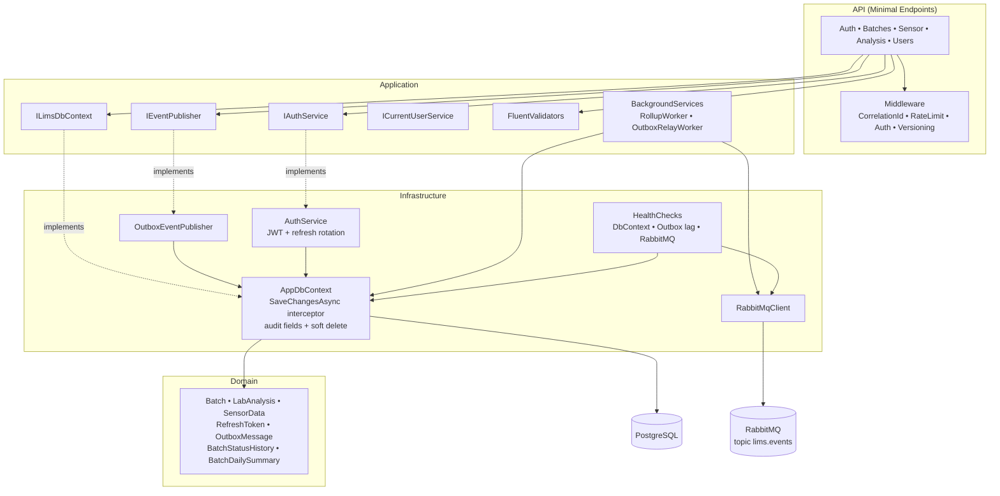
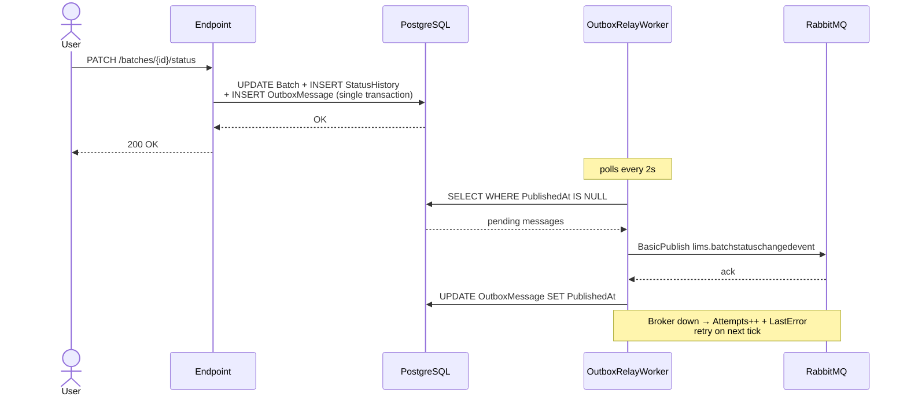

# 🧪 LIMS — Laboratory Information Management System

<p align="right">
  <a href="README.md">🇧🇷 Português</a> · <strong>🇬🇧 English</strong>
</p>

**Production-grade LIMS exploring compliance patterns in regulated industries** — cross-cutting audit trail, transactional outbox pattern, OWASP-grade refresh token rotation, soft delete with global query filter, OpenTelemetry, custom healthchecks.

> **Case study:** industrial hemp (legal THC limit ≤ 0.3%). The domain was chosen because it has **the richest and most non-obvious regulation of the moment** — forcing modeling decisions that a generic CRUD would never surface.

[](https://github.com/SauloJuniorsj/LimsProject/actions)


### 🚀 Live demo

**[lims-project-rho.vercel.app](https://lims-project-rho.vercel.app/)** — backend runs on Render's free tier, so the first request may take ~30-60s to wake up (cold start).

Demo accounts (one click on the login screen, no sign-up needed):

| Role | Email | Password |
|---|---|---|
| Admin | `admin@lims.demo` | `Demo1234` |
| Lab (technician) | `lab@lims.demo` | `Demo1234` |

Tip: open an active batch and click **"▶ Simulate sensor"** to watch synthetic telemetry arrive live on the chart and table.

<p align="center">
  
</p>

<table>
  <tr>
    <td></td>
    <td></td>
  </tr>
  <tr>
    <td align="center"><sub>Login with demo accounts (one click)</sub></td>
    <td align="center"><sub>Dashboard — KPIs and last-30-days activity</sub></td>
  </tr>
</table>

---

## 🎯 What this system solves

Regulated industries (industrial hemp, pharma, food, medical devices) must prove to regulators **where every batch came from, how it was processed, and which analyses cleared it for release**. This LIMS implements the full architectural pattern of that requirement:

- **Batch lifecycle as a state machine**: `Germination → Growth → Harvested → Testing → Released | Rejected`. Invalid transitions return **422 Unprocessable Entity**.
- **Complete audit trail**: every status change records who, when, and why — including initial creation and automatic transitions via lab analysis.
- **Hemp compliance**: a batch with THC > 0.3% cannot be approved (validation rule in the Application layer).
- **Soft delete + per-field audit trail**: `Batch` implements `IAuditable` + `ISoftDeletable`. A `SaveChangesAsync` interceptor automatically fills `CreatedBy/UpdatedAt/UpdatedBy` and converts DELETEs into UPDATEs with `DeletedAt` set — a global query filter hides deleted rows from normal queries (`IgnoreQueryFilters()` for inspection). Endpoint code **doesn't change**.
- **Background rollup**: consolidates millions of sensor readings into daily summaries (min/max/avg/count), processing only active batches.
- **Cultivation telemetry**: every temperature reading updates `Batch.CurrentTemperature` and is paginated.
- **Certificate of Analysis (CoA)**: a single endpoint aggregating batch + analyses + aggregated environmental conditions + lifecycle + compliance — the industry-standard document.
- **Live sensor simulator**: triggers a background burst of synthetic readings (`POST /sensor-data/simulate`) to demonstrate telemetry + `RollupWorker` reacting in real time, no hardware required.

---

## 🏗️ Architecture

Onion / Clean Architecture with 4 layers. No inner layer knows about outer ones. `ILimsDbContext` abstracts persistence from the Application services.



### Domain event flow (outbox pattern)



---

## 🛠️ Tech Stack

| Layer | Technology |
|---|---|
| Runtime | .NET 10, ASP.NET Core (Controllers + Asp.Versioning.Mvc) |
| Persistence | PostgreSQL 16 + Entity Framework Core 10 (Npgsql) |
| Authentication | ASP.NET Core Identity + JWT Bearer (1h access) + **refresh tokens with rotation + reuse detection (OWASP)** + Roles (`Admin`, `Lab`) |
| Validation | FluentValidation (validators in the Application layer) |
| Background | `BackgroundService` + `IServiceScopeFactory` for safe scopes |
| Rate limiting | `Microsoft.AspNetCore.RateLimiting` (fixed window on `/auth/login`) |
| API versioning | `Asp.Versioning.Http` — `api-version` header or query string, default v1.0 non-breaking |
| Caching | `IMemoryCache` on read-heavy GETs with targeted invalidation on writes |
| Observability | Health checks (`/health`) + custom (Outbox lag, RabbitMQ probe) + **OpenTelemetry** (ASP.NET Core traces + custom domain metrics + runtime metrics, Console exporter) |
| Messaging | **RabbitMQ** topic exchange (`lims.events`) + **Outbox pattern** with a relay worker, retry, and implicit dead-letter |
| Documentation | Swashbuckle (Swagger UI with Bearer auth button) |
| Tests | xUnit + FluentAssertions + NSubstitute + EF InMemory + WebApplicationFactory |
| Infra | Docker multi-stage + docker-compose (Postgres + API + RabbitMQ) |
| CI/CD | GitHub Actions: build + test + coverage |

---

## 🔐 Auth & Permissions

### Token flow (production-grade)

- `POST /auth/register` — anonymous, registers a user with role `Lab` or `Admin`.
- `POST /auth/login` — anonymous, **rate-limited** (30 req/min, configurable), returns `{ accessToken, refreshToken, accessTokenExpiresAt, refreshTokenExpiresAt }`. Access token lives **1h**, refresh token **30 days**.
- `POST /auth/refresh` — anonymous, **rate-limited**, body `{ refreshToken }`, returns new tokens. **Rotation:** the previous refresh is invalidated on every use (one-time-use).
- `POST /auth/logout` — anonymous, body `{ refreshToken }`, idempotent (204 always). Revokes the refresh token.

**Security:**
- Refresh tokens are 64 random base64 bytes (~88 URL-safe chars)
- Stored as **SHA-256 hash** — DB breach ≠ token leak
- Delivered to the client via **HttpOnly + Secure + SameSite=Strict cookie** with `Path=/auth` — JavaScript can't read it (XSS-proof), the cookie only travels on auth calls. The frontend doesn't even see the refresh token, only the in-memory access token.
- **Reuse detection (OWASP):** if a previously-revoked token is presented, the ENTIRE token chain for that user is revoked (protects against stolen tokens)
- Replaying the same refresh twice → the second call returns 401

### Permission matrix

| Endpoint | Permission |
|---|---|
| `POST /batches` | `Admin` |
| `GET /batches`, `/batches/{id}/summary` | authenticated |
| `PATCH /batches/{id}/status` | `Admin` |
| `DELETE /batches/{id}` | `Admin` (rejects batches in Testing/Released) |
| `POST /batches/{id}/analysis` | `Lab` or `Admin` |
| `GET /batches/{id}/analyses` | `Lab` or `Admin` |
| `POST /batches/{id}/sensor-data` | `Lab` or `Admin` |
| `GET /batches/{id}/sensor-data` | authenticated |
| `GET /batches/{id}/daily-summaries` | authenticated |
| `GET /batches/{id}/status-history` | authenticated |
| `GET /batches/{id}/certificate-of-analysis` | authenticated |
| `GET /users` (paginated, filter by email) | `Admin` |
| `DELETE /users/{id}` (blocks self-deletion → 422) | `Admin` |
| `PUT /users/{id}/role` (Lab\|Admin, blocks self-demotion) | `Admin` |
| `POST /debug/populate-elegant` | `Admin` (Development/Testing only) |

---

## 🎨 Frontend (web/)

SPA in [`web/`](web/) — React 19 + Vite + TypeScript + Tailwind + TanStack Router/Query + Recharts + Biome. See [`web/README.md`](web/README.md) for details.

```bash
cd web && npm install && npm run dev   # http://localhost:5173
```

Same origin as the API via Vite proxy (zero CORS). Pages: login, dashboard (KPIs), batch list (filters + pagination), batch detail (timeline + analyses), printable Certificate of Analysis.

---

## 🌐 Live Deploy (free tier, no credit card)

Recommended free hosting setup:

| Layer | Where | Cost |
|---|---|---|
| **Frontend** (`web/`) | [Vercel](https://vercel.com) (Hobby) | $0 |
| **Backend** (.NET API) | [Render](https://render.com) (Free Web Service via Docker) | $0 |
| **PostgreSQL** | [Neon](https://neon.tech) (free tier, 500MB, persistent) | $0 |
| **RabbitMQ** | Disabled in prod (`RabbitMq__Enabled=false`) — `NullEventPublisher` handles it | — |

**Render manifest:** [`render.yaml`](render.yaml) (Blueprint).
**Vercel proxy:** [`web/vercel.json`](web/vercel.json) — rewrites `/auth/*`, `/batches/*`, `/users/*` etc to the Render backend, keeping the browser on **same-origin** (HttpOnly cookies work, zero CORS).

> ⚠️ **Trade-off**: Render free **sleeps after 15min** idle — first request after sleep wakes up in ~30-60s (.NET 10 cold start). Acceptable for portfolio demo.

### Step-by-step

1. **Neon** (Postgres) — create project, copy the connection string in Npgsql format:
   ```
   Host=ep-xxx.neon.tech;Database=lims;Username=lims_owner;Password=...;SSL Mode=Require;Trust Server Certificate=true
   ```
2. **Render** — `New → Blueprint`, select this repo, it reads `render.yaml`. Paste the 2 env vars marked `sync: false`:
   - `Jwt__Key`: generate a new one with `openssl rand -base64 48`
   - `ConnectionStrings__Default`: the Neon string
3. **Vercel** — `New Project`, select the repo, `Root Directory = web`, framework `Vite`. Automatic build.
4. **Update `vercel.json`** if the Render subdomain differs from `limsproject.onrender.com`.

---

## 🐳 How to run

### Initial setup (once)

Before the first `docker-compose up`, create your local `.env` from the template:

```bash
cp .env.example .env
# open .env and adjust values (especially JWT_KEY and POSTGRES_PASSWORD)
```

`.env` is **gitignored** — credentials never reach the repo. The committed `.env.example` documents which variables the system expects.

> **In production**: do NOT push `.env`. Register variables in the platform's secrets store (Fly.io `fly secrets set`, Railway/Render dashboard, AWS Secrets Manager, etc.). The code reads env vars regardless of source.

### Option 1: docker-compose (everything in one command)

```bash
docker-compose up -d
```

Brings up Postgres (with healthcheck), API (with auto-migration on startup), and the RabbitMQ broker. API at `http://localhost:8080`, Swagger at `http://localhost:8080/swagger`.

### Option 2: local dev

```bash
docker-compose up -d db                # Postgres only
dotnet ef database update              # apply migrations
dotnet run                             # API on https://localhost:5xxx
```

Relevant config in `appsettings.json` or env vars:

```json
{
  "ConnectionStrings": { "Default": "Host=...;Database=lims_db;..." },
  "Jwt": { "Key": "...", "Issuer": "LimsProject", "Audience": "LimsProject" },
  "Rollup": { "IntervalSeconds": 60 },
  "RateLimit": { "LoginPerMinute": 30 }
}
```

---

## 🧪 Tests

```bash
dotnet test
```

143 tests (backend) + 14 (frontend, Vitest) covering:

- **Unit tests** (validators): `BatchValidator`, `LabAnalysisValidator`, `SensorReadingValidator`, `RollupService`, `RollupWorker` (with NSubstitute)
- **Integration tests** (TestServer + EF InMemory): auth, batches CRUD/pagination/filters/transitions, analyses, sensor data, daily summaries, status history, security (401/403)
- **Architecture fitness tests** (NetArchTest): enforce the Onion dependency graph (Domain knows no other layer, Application doesn't see Infrastructure/API, Infrastructure doesn't see API, entities are POCOs free of EF Core). PRs that violate **break the build**.

Coverage with exclusions (migrations, generated files) via `coverlet.runsettings`. **CI gate: line coverage < 90% fails the build** (current baseline: 96%).

---

## 🚨 Errors: Problem Details (RFC 7807) across the whole API

Every error response follows [RFC 7807](https://datatracker.ietf.org/doc/html/rfc7807) — structured JSON with `type`, `title`, `status`, `detail`, and custom extensions where useful. Example of an invalid status transition:

```json
HTTP/1.1 422 Unprocessable Entity
Content-Type: application/problem+json

{
  "title": "Invalid status transition",
  "status": 422,
  "detail": "Transição inválida: Germination → Harvested.",
  "currentStatus": "Germination",
  "requestedStatus": "Harvested",
  "allowedTransitions": ["Growth"]
}
```

Centralized factory in [`API/Problems.cs`](API/Problems.cs) avoids scattered error strings and enforces consistency.

---

## 🪪 Correlation IDs

Every request carries an `X-Correlation-Id` (received from the client or generated server-side). The middleware:
- Echoes the ID in the response header (clients can reference it)
- Replaces `HttpContext.TraceIdentifier`
- Pushes it as a **log scope** — every log line of the request carries `CorrelationId={id}`

Ready for log correlation across microservices / layers / load balancers.

---

## 📨 Domain events (RabbitMQ)

Events published on the durable topic exchange `lims.events`, routing keys `lims.<eventname>`:

| Routing key | Event | Triggered by |
|---|---|---|
| `lims.batchcreatedevent` | `BatchCreatedEvent(BatchId, Strain, OccurredAt)` | `POST /batches` |
| `lims.batchstatuschangedevent` | `BatchStatusChangedEvent(BatchId, From, To, ChangedBy, Reason, OccurredAt)` | `PATCH /batches/{id}/status` and automatic transitions via analysis |
| `lims.analysiscompletedevent` | `AnalysisCompletedEvent(BatchId, AnalysisId, Thc, Cbd, Passed, OccurredAt)` | `POST /batches/{id}/analysis` |

### Outbox pattern — zero dual-write, zero event loss

`IEventPublisher` is an abstraction in the Application layer with two implementations:

- **`OutboxEventPublisher`** (broker on) — writes an `OutboxMessage` to the DbContext **in the same transaction** as the domain entity. Endpoints call `events.PublishAsync(...)` *before* `SaveChangesAsync` — a single save commits batch + outbox row atomically.
- **`NullEventPublisher`** (Testing / broker off) — no-op.

The **`OutboxRelayWorker`** (singleton BackgroundService) polls every `Outbox:PollIntervalSeconds` (default 2s), picks `Outbox:BatchSize` pending messages ordered by `CreatedAt`, and dispatches them to RabbitMQ via `IRabbitMqClient` (pure AMQP client, with no domain knowledge). On failure: `Attempts++` and `LastError = ex.Message`. After `Outbox:MaxAttempts` (default 5) the message stays orphan — implicit dead-letter, easy to inspect with a SQL query.

**Outcomes:**
- Process crashes between commit and publish? The event is already in the table → the worker picks it up later.
- Broker offline? Messages accumulate until it's back (eventually consistent).
- The worker requires an active broker; **endpoints do not depend** on the broker at runtime.

Enabled via `RabbitMq__Enabled=true`. `docker-compose up` brings up the broker and enables it; running locally without a broker, `NullEventPublisher` is used automatically.

---

## 📊 Domain metrics (OpenTelemetry)

Custom metrics exposed via the `"LimsProject"` Meter:

| Metric | Type | Tags | Description |
|---|---|---|---|
| `lims.batches.created` | Counter | — | Batches created |
| `lims.analyses.completed` | Counter | `passed=true\|false` | Lab analyses finalized |
| `lims.status.transitions` | Counter | `from`, `to` | Batch status changes |

Plus ASP.NET Core HTTP traces and runtime metrics (.NET GC, heap, thread pool). Console exporter by default; in production, configure OTLP via the `OTEL_EXPORTER_OTLP_ENDPOINT` env var. Disabled in the `Testing` environment to keep test output clean.

---

## 🏷️ API versioning + 🚀 caching + 🩺 health checks

**Versioning** (`Asp.Versioning.Http`): default `v1.0` applied to all endpoints in a route group `app.MapGroup("").WithApiVersionSet(...)`. The client sends `api-version: 1.0` as a header or `?api-version=1.0` as a query string. No header → falls back to v1.0 (`AssumeDefaultVersionWhenUnspecified`). The response carries `api-supported-versions: 1.0` automatically. Adding v2 = creating a second group with `.HasApiVersion(2, 0)` — coexistence without deprecating v1.

**Caching** (`IMemoryCache`): `GET /batches/{id}/summary` caches for 30s (sliding 10s). Keys centralized in [`Application/Caching/CacheKeys.cs`](Application/Caching/CacheKeys.cs). **Targeted invalidation** on writes (`PATCH /status` and `DELETE`) → `cache.Remove(...)` for the specific key. The batch list is **not cached** (filter combinatorics would explode cache keys; clients tend to paginate and change filters anyway).

**Health checks** (`/health`):
- DbContext connectivity (Identity + LIMS DB)
- `OutboxLagHealthCheck` — counts `OutboxMessages` with `PublishedAt = null AND CreatedAt < now - 1min`. 0 = healthy, 1-9 = degraded, 10+ = unhealthy (signals broker down or worker stalled)
- `RabbitMqHealthCheck` — calls `IRabbitMqClient.ProbeAsync` (registered only when the broker is enabled)

**Advanced sorting + filtering** on `GET /batches`: `sortBy=createdAt|strain|status` (explicit whitelist) + `sortDir=asc|desc` + `createdAfter` / `createdBefore`. Default: createdAt DESC. Invalid values silently fall back to default.

---

## 🗃️ Soft delete + audit fields (cross-cutting)

Interfaces in the Domain layer: `IAuditable` (CreatedAt/CreatedBy/UpdatedAt/UpdatedBy) and `ISoftDeletable` (DeletedAt/DeletedBy). `Batch` implements both. **Endpoints don't touch these fields** — all the logic lives in `AppDbContext.SaveChangesAsync`:

```csharp
foreach (var entry in ChangeTracker.Entries<IAuditable>())
{
    if (entry.State == EntityState.Added)    entry.Entity.CreatedAt = now; ...
    if (entry.State == EntityState.Modified) entry.Entity.UpdatedAt = now; ...
}

foreach (var entry in ChangeTracker.Entries<ISoftDeletable>())
{
    if (entry.State == EntityState.Deleted)
    {
        entry.State = EntityState.Modified;  // converts DELETE into UPDATE
        entry.Entity.DeletedAt = now;
    }
}
```

The user identity comes through `ICurrentUserService` (abstracts `IHttpContextAccessor`). In background workers, `GetEmail()` gracefully returns `null` — the field stays empty.

The **global query filter** `b => b.DeletedAt == null` on `Batch` makes `db.Batches.Find/Any/Where` automatically exclude soft-deleted rows. `IgnoreQueryFilters()` allows inspection for auditing. The interface-based typing (`ChangeTracker.Entries<IAuditable>()`) guarantees other entities like `RefreshToken`, `OutboxMessage`, `BatchStatusHistory` are **not** touched by the interceptor — opt-in via interface.

---

## 📋 Design decisions worth noting

- **InMemory provider in Testing**: `Program.cs` only registers Npgsql outside the `Testing` environment, avoiding the `IDatabaseProvider` conflict when `WebApplicationFactory` injects the InMemory provider.
- **`IServiceScopeFactory` in the worker**: `RollupWorker` is a singleton but needs a `DbContext` (scoped) — it creates a scope per iteration, with try/catch and a configurable interval.
- **Static `StatusHistoryRecorder`**: a simple cross-cutting concern for writing audit entries without ServiceLocator or MediatR; takes `ClaimsPrincipal` to capture the user without coupling to `HttpContext`.
- **Explicit state machine**: a dictionary of valid transitions in `BatchesController` avoids logic scattered across the code and returns a clear message describing the allowed options.

---

> 💡 **Trivia**: the `AvarageTemperature` column in Postgres preserves a legacy typo to demonstrate explicit mapping via `HasColumnName` — clean code (`Batch.AverageTemperature`) with the legacy schema intact.
