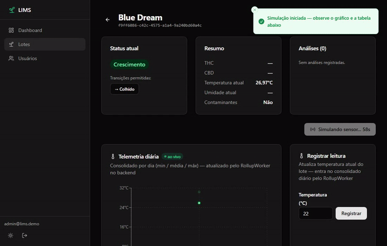
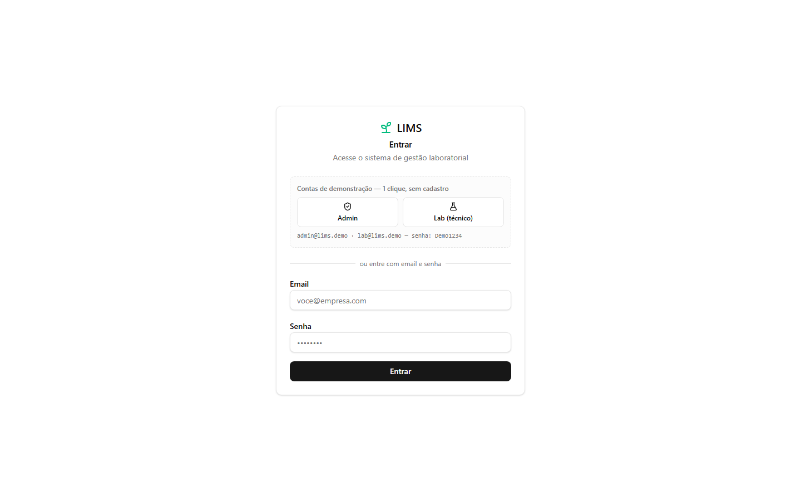
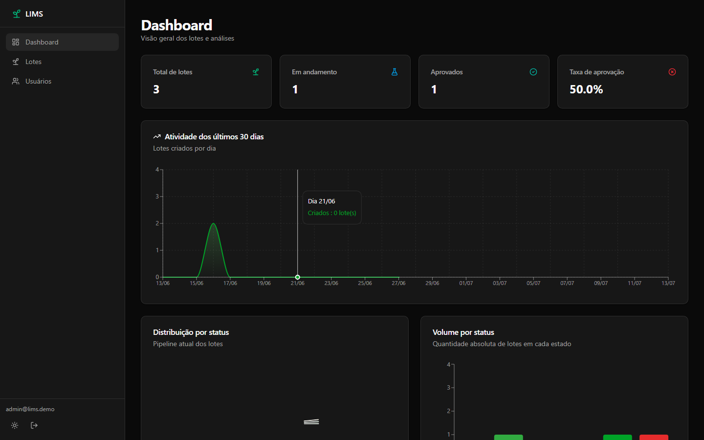
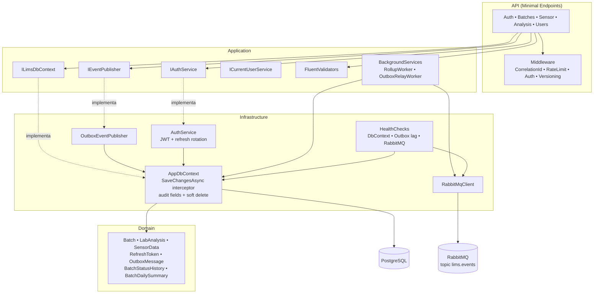
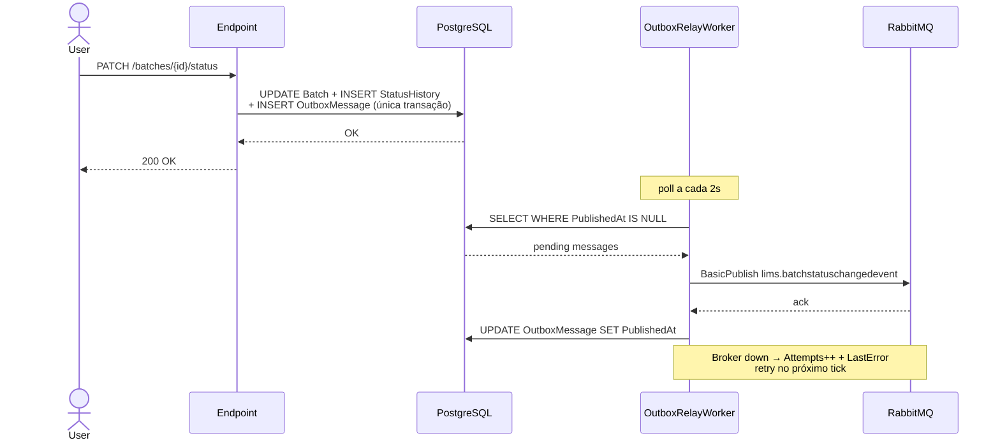

# 🧪 LIMS — Laboratory Information Management System

<p align="right">
  <strong>🇧🇷 Português</strong> · <a href="README.en.md">🇬🇧 English</a>
</p>

**LIMS production-grade explorando padrões de compliance em indústria regulada** — audit trail cross-cutting, outbox pattern transacional, refresh tokens com rotation OWASP-grade, soft delete com query filter global, OpenTelemetry, healthchecks customizados.

> **Case study escolhido:** cânhamo industrial (limite legal THC ≤ 0.3%). O domínio foi escolhido por ter **a regulação mais rica e fora-do-óbvio** do momento — força decisões de modelagem que um CRUD genérico não força.

[](https://github.com/SauloJuniorsj/LimsProject/actions)


### 🚀 Demo ao vivo

**[lims-project-rho.vercel.app](https://lims-project-rho.vercel.app/)** — backend no Render free tier, então a primeira request pode levar ~30-60s pra "acordar" (cold start).

Contas de demonstração (1 clique na tela de login, sem cadastro):

| Papel | Email | Senha |
|---|---|---|
| Admin | `admin@lims.demo` | `Demo1234` |
| Lab (técnico) | `lab@lims.demo` | `Demo1234` |

Dica: abra um lote em estado ativo e clique em **"▶ Simular sensor"** pra ver telemetria sintética chegando ao vivo no gráfico e na tabela.

<p align="center">
  
</p>

<table>
  <tr>
    <td></td>
    <td></td>
  </tr>
  <tr>
    <td align="center"><sub>Login com contas demo (1 clique)</sub></td>
    <td align="center"><sub>Dashboard — KPIs e atividade dos últimos 30 dias</sub></td>
  </tr>
</table>

---

## 🎯 O que o sistema resolve

Indústrias reguladas (cânhamo industrial, farma, alimentos, dispositivos médicos) precisam provar a reguladores **onde cada lote veio, como foi processado e quais análises liberaram a venda**. Este LIMS implementa o padrão arquitetural completo dessa exigência:

- **Ciclo de vida do lote** como máquina de estados: `Germination → Growth → Harvested → Testing → Released | Rejected`. Transições inválidas retornam **422 Unprocessable Entity**.
- **Audit trail completo**: toda mudança de status grava quem, quando e por quê (incluindo a criação inicial e mudanças automáticas via análise laboratorial).
- **Compliance de cânhamo**: lote com THC > 0.3% não pode ser aprovado (regra de validação na camada de aplicação).
- **Soft delete + audit trail por campo**: `Batch` implementa `IAuditable` + `ISoftDeletable`. Um interceptor no `SaveChangesAsync` preenche `CreatedBy/UpdatedAt/UpdatedBy` automaticamente e converte DELETEs em UPDATEs com `DeletedAt` — global query filter esconde os apagados de queries normais (`IgnoreQueryFilters()` pra inspecionar). Endpoints **não mudam**.
- **Rollup em background**: consolida milhões de leituras de sensores em sumários diários (min/max/avg/count), processando apenas lotes ativos.
- **Telemetria de cultivo**: cada leitura de temperatura atualiza `Batch.CurrentTemperature` e fica disponível paginada.
- **Certificate of Analysis (CoA)**: endpoint único que agrega lote + análises + condições ambientais agregadas + ciclo de vida + compliance — o documento padrão da indústria.
- **Simulador de sensor ao vivo**: dispara um burst de leituras sintéticas em background (`POST /sensor-data/simulate`) pra demonstrar telemetria + `RollupWorker` reagindo em tempo real, sem precisar de hardware.

---

## 🏗️ Arquitetura

Onion / Clean Architecture com 4 camadas. Nenhuma camada interna conhece as externas. `ILimsDbContext` abstrai persistência para os serviços de aplicação.



### Fluxo de evento de domínio (outbox pattern)



---

## 🛠️ Tech Stack

| Camada | Tecnologia |
|---|---|
| Runtime | .NET 10, ASP.NET Core (Controllers + Asp.Versioning.Mvc) |
| Persistência | PostgreSQL 16 + Entity Framework Core 10 (Npgsql) |
| Autenticação | ASP.NET Core Identity + JWT Bearer (access 1h) + **refresh tokens com rotation + reuse detection (OWASP)** + Roles (`Admin`, `Lab`) |
| Validação | FluentValidation (validators no Application layer) |
| Background | `BackgroundService` + `IServiceScopeFactory` para scopes seguros |
| Rate limiting | `Microsoft.AspNetCore.RateLimiting` (fixed window no `/auth/login`) |
| API versioning | `Asp.Versioning.Http` — header `api-version` ou query string, default v1.0 não-breaking |
| Caching | `IMemoryCache` em GETs read-heavy com invalidação targeted nos writes |
| Observabilidade | Health checks (`/health`) + custom (Outbox lag, RabbitMQ probe) + **OpenTelemetry** (traces ASP.NET Core + métricas custom de domínio + runtime metrics, Console exporter) |
| Messaging | **RabbitMQ** topic exchange (`lims.events`) + **Outbox pattern** com worker de relay, retry e dead-letter implícito |
| Documentação | Swashbuckle (Swagger UI com botão de auth Bearer) |
| Testes | xUnit + FluentAssertions + NSubstitute + EF InMemory + WebApplicationFactory |
| Infra | Docker multi-stage + docker-compose (Postgres + API + RabbitMQ) |
| CI/CD | GitHub Actions: build + test + coverage |

---

## 🔐 Auth & Permissões

### Fluxo de tokens (production-grade)

- `POST /auth/register` — anônimo, registra usuário com role `Lab` ou `Admin`.
- `POST /auth/login` — anônimo, **rate-limited** (30 req/min, configurável), retorna `{ accessToken, refreshToken, accessTokenExpiresAt, refreshTokenExpiresAt }`. Access token vive **1h**, refresh token vive **30 dias**.
- `POST /auth/refresh` — anônimo, **rate-limited**, body `{ refreshToken }`, retorna novos tokens. **Rotation:** o refresh antigo é invalidado a cada uso (one-time-use).
- `POST /auth/logout` — anônimo, body `{ refreshToken }`, idempotente (204 sempre). Revoga o refresh token.

**Segurança:**
- Refresh tokens são 64 bytes random base64 (~88 chars URL-safe)
- Persistidos como **SHA-256 hash** — DB comprometido ≠ tokens vazados
- Entregues ao cliente via **cookie HttpOnly + Secure + SameSite=Strict** com `Path=/auth` — JavaScript não consegue ler (XSS-proof), cookie só sobe nas chamadas de auth. Frontend nem vê o refresh token, só o access em memória.
- **Reuse detection (OWASP):** se um token já revogado é apresentado, TODA a cadeia daquele usuário é revogada (proteção contra roubo de token)
- Replay do mesmo refresh duas vezes → segunda chamada retorna 401

### Matriz de permissões

| Endpoint | Permissão |
|---|---|
| `POST /batches` | `Admin` |
| `GET /batches`, `/batches/{id}/summary` | autenticado |
| `PATCH /batches/{id}/status` | `Admin` |
| `DELETE /batches/{id}` | `Admin` (rejeita lotes em Testing/Released) |
| `POST /batches/{id}/analysis` | `Lab` ou `Admin` |
| `GET /batches/{id}/analyses` | `Lab` ou `Admin` |
| `POST /batches/{id}/sensor-data` | `Lab` ou `Admin` |
| `GET /batches/{id}/sensor-data` | autenticado |
| `GET /batches/{id}/daily-summaries` | autenticado |
| `GET /batches/{id}/status-history` | autenticado |
| `GET /batches/{id}/certificate-of-analysis` | autenticado |
| `GET /users` (paginado, filtro por email) | `Admin` |
| `DELETE /users/{id}` (não permite auto-exclusão → 422) | `Admin` |
| `PUT /users/{id}/role` (Lab\|Admin, bloqueia auto-rebaixamento) | `Admin` |
| `POST /debug/populate-elegant` | `Admin` (apenas em Development/Testing) |

---

## 🎨 Frontend (web/)

Aplicação SPA em [`web/`](web/) — React 19 + Vite + TypeScript + Tailwind + TanStack Router/Query + Recharts + Biome. Veja [`web/README.md`](web/README.md) pra detalhes.

```bash
cd web && npm install && npm run dev   # http://localhost:5173
```

Mesma origin que a API via Vite proxy (zero CORS). Páginas: login, dashboard (KPIs), lista de lotes (filtros + paginação), detalhe do lote (timeline + análises), Certificate of Analysis printable.

---

## 🌐 Live Deploy (free tier, sem cartão)

Setup recomendado pra hospedagem free real:

| Camada | Onde | Custo |
|---|---|---|
| **Frontend** (`web/`) | [Vercel](https://vercel.com) (Hobby) | R$ 0 |
| **Backend** (.NET API) | [Render](https://render.com) (Free Web Service via Docker) | R$ 0 |
| **PostgreSQL** | [Neon](https://neon.tech) (free tier, 500MB, persistente) | R$ 0 |
| **RabbitMQ** | Desabilitado em prod (`RabbitMq__Enabled=false`) — `NullEventPublisher` no lugar | — |

**Manifest do Render:** [`render.yaml`](render.yaml) (Blueprint).
**Proxy do Vercel:** [`web/vercel.json`](web/vercel.json) — reescreve `/auth/*`, `/batches/*`, `/users/*` etc pro backend Render, mantendo o browser em **same-origin** (cookies HttpOnly funcionam, zero CORS).

> ⚠️ **Trade-off**: Render free **dorme após 15min** de inatividade — primeira request após sleep acorda em ~30-60s (cold start do .NET 10). Aceitável pra demo de portfolio.

### Passo a passo

1. **Neon** (Postgres) — cria projeto, copia connection string no formato Npgsql:
   ```
   Host=ep-xxx.neon.tech;Database=lims;Username=lims_owner;Password=...;SSL Mode=Require;Trust Server Certificate=true
   ```
2. **Render** — `New → Blueprint`, seleciona este repo, ele lê `render.yaml`. Cola as 2 env vars marcadas `sync: false`:
   - `Jwt__Key`: gera uma nova com `openssl rand -base64 48`
   - `ConnectionStrings__Default`: a string do Neon
3. **Vercel** — `New Project`, seleciona o repo, `Root Directory = web`, framework `Vite`. Build automático.
4. **Atualiza `vercel.json`** se o subdomínio do Render for diferente de `limsproject.onrender.com`.

---

## 🐳 Como rodar

### Setup inicial (uma vez só)

Antes do primeiro `docker-compose up`, crie seu `.env` local a partir do template:

```bash
cp .env.example .env
# abra .env e ajuste os valores (especialmente JWT_KEY e POSTGRES_PASSWORD)
```

O arquivo `.env` é **gitignored** — credenciais nunca vão pro repositório. O template `.env.example` é commitado pra documentar quais variáveis o sistema espera.

> **Em produção**: NÃO suba `.env`. Cadastre as variáveis no sistema de secrets da plataforma (Fly.io `fly secrets set`, Railway/Render dashboard, AWS Secrets Manager, etc.). O código lê de env vars independente da origem.

### Opção 1: docker-compose (tudo em um comando)

```bash
docker-compose up -d
```

Sobe Postgres (com healthcheck), API (com auto-migration on startup) e RabbitMQ broker. API disponível em `http://localhost:8080`, Swagger em `http://localhost:8080/swagger`.

### Opção 2: dev local

```bash
docker-compose up -d db                # só Postgres
dotnet ef database update              # aplica migrations
dotnet run                             # API em https://localhost:5xxx
```

Configurações relevantes em `appsettings.json` ou variáveis de ambiente:

```json
{
  "ConnectionStrings": { "Default": "Host=...;Database=lims_db;..." },
  "Jwt": { "Key": "...", "Issuer": "LimsProject", "Audience": "LimsProject" },
  "Rollup": { "IntervalSeconds": 60 },
  "RateLimit": { "LoginPerMinute": 30 }
}
```

---

## 🧪 Tests

```bash
dotnet test
```

143 testes (backend) + 14 (frontend, Vitest) cobrindo:

- **Unit tests** (validators): `BatchValidator`, `LabAnalysisValidator`, `SensorReadingValidator`, `RollupService`, `RollupWorker` (com NSubstitute)
- **Integration tests** (TestServer + EF InMemory): auth, batches CRUD/paginação/filtros/transições, análises, sensor data, daily summaries, status history, segurança (401/403)
- **Architecture fitness tests** (NetArchTest): enforçam o grafo Onion (Domain não conhece outras camadas, Application não vê Infrastructure/API, Infrastructure não vê API, entidades são POCOs sem EF Core). PR que viola **quebra o build**.

Coverage com exclusões (migrations, generated files) via `coverlet.runsettings`. **Gate de CI: line coverage < 90% reprova o build** (baseline atual: 96%).

---

## 🚨 Errors: Problem Details (RFC 7807) em toda a API

Toda resposta de erro segue [RFC 7807](https://datatracker.ietf.org/doc/html/rfc7807) — JSON estruturado com `type`, `title`, `status`, `detail`, e extensões custom quando aplicável. Exemplo de transição de status inválida:

```json
HTTP/1.1 422 Unprocessable Entity
Content-Type: application/problem+json

{
  "title": "Invalid status transition",
  "status": 422,
  "detail": "Transição inválida: Germination → Harvested.",
  "currentStatus": "Germination",
  "requestedStatus": "Harvested",
  "allowedTransitions": ["Growth"]
}
```

Factory centralizada em [`API/Problems.cs`](API/Problems.cs) evita strings de erro espalhadas e garante consistência.

---

## 🪪 Correlation IDs

Todo request carrega um `X-Correlation-Id` (recebido do cliente ou gerado server-side). O middleware:
- Devolve o ID no response header (cliente consegue referenciar)
- Substitui `HttpContext.TraceIdentifier`
- Empurra como **log scope** — toda linha de log do request carrega `CorrelationId={id}`

Pronto pra correlacionar logs entre microsserviços / camadas / loadbalancers.

---

## 📨 Eventos de domínio (RabbitMQ)

Eventos publicados no exchange topic `lims.events` (durável), com routing keys `lims.<eventname>`:

| Routing key | Evento | Disparado por |
|---|---|---|
| `lims.batchcreatedevent` | `BatchCreatedEvent(BatchId, Strain, OccurredAt)` | `POST /batches` |
| `lims.batchstatuschangedevent` | `BatchStatusChangedEvent(BatchId, From, To, ChangedBy, Reason, OccurredAt)` | `PATCH /batches/{id}/status` e mudança automática via análise |
| `lims.analysiscompletedevent` | `AnalysisCompletedEvent(BatchId, AnalysisId, Thc, Cbd, Passed, OccurredAt)` | `POST /batches/{id}/analysis` |

### Outbox pattern — zero dual-write, zero perda de evento

`IEventPublisher` é abstração no Application layer com duas implementações:

- **`OutboxEventPublisher`** (broker on) — escreve `OutboxMessage` no DbContext **na mesma transação** da entidade de domínio. Endpoints chamam `events.PublishAsync(...)` *antes* de `SaveChangesAsync` — o save commita batch + outbox row atomicamente.
- **`NullEventPublisher`** (Testing / broker off) — no-op.

O **`OutboxRelayWorker`** (BackgroundService singleton) polla a cada `Outbox:PollIntervalSeconds` (default 2s), pega `Outbox:BatchSize` mensagens pendentes ordenadas por `CreatedAt`, e despacha pro RabbitMQ via `IRabbitMqClient` (cliente AMQP puro, sem responsabilidade de domain events). Em falha: `Attempts++` e `LastError = ex.Message`. Após `Outbox:MaxAttempts` (default 5) a mensagem fica órfã — dead-letter implícito, fácil de inspecionar por query SQL.

**Resultados:**
- Processo crasha entre commit do batch e publish? Evento já está na tabela → worker pega depois.
- Broker offline? Mensagens acumulam até voltar (eventually consistent).
- Worker requer broker ativo; endpoints **não dependem** do broker em runtime.

Habilitado via `RabbitMq__Enabled=true`. O `docker-compose up` sobe o broker e habilita; rodando local sem broker, `NullEventPublisher` é usado automaticamente.

---

## 📊 Métricas de domínio (OpenTelemetry)

Métricas customizadas expostas via `Meter` "LimsProject":

| Métrica | Tipo | Tags | Descrição |
|---|---|---|---|
| `lims.batches.created` | Counter | — | Lotes criados |
| `lims.analyses.completed` | Counter | `passed=true\|false` | Análises laboratoriais finalizadas |
| `lims.status.transitions` | Counter | `from`, `to` | Mudanças de status de lote |

Mais traces HTTP do ASP.NET Core e métricas de runtime (.NET GC, heap, thread pool). Console exporter por padrão; em produção, configurar OTLP via env var `OTEL_EXPORTER_OTLP_ENDPOINT`. Desativado no ambiente `Testing` para não poluir output.

---

## 🏷️ API versioning + 🚀 caching + 🩺 health checks

**Versioning** (`Asp.Versioning.Http`): default `v1.0` aplicado a todos os endpoints num route group `app.MapGroup("").WithApiVersionSet(...)`. Cliente envia `api-version: 1.0` no header ou `?api-version=1.0` na query. Sem header → fallback pra v1.0 (`AssumeDefaultVersionWhenUnspecified`). Response carrega `api-supported-versions: 1.0` automaticamente. Adicionar v2 = criar segundo group `.HasApiVersion(2, 0)` — coexistência sem deprecar v1.

**Caching** (`IMemoryCache`): `GET /batches/{id}/summary` cacheia por 30s (sliding 10s). Chaves centralizadas em [`Application/Caching/CacheKeys.cs`](Application/Caching/CacheKeys.cs). Invalidação **targeted** nos writes (`PATCH /status` e `DELETE`) → `cache.Remove(...)` da chave específica. Lista de batches **não é cacheada** (combinatória de filtros geraria muitas chaves obsoletas; o cliente costuma paginar e mudar filtros).

**Health checks** (`/health`):
- DbContext connectivity (Identity + LIMS DB)
- `OutboxLagHealthCheck` — conta `OutboxMessages` com `PublishedAt = null AND CreatedAt < now - 1min`. 0 = healthy, 1-9 = degraded, 10+ = unhealthy (sinaliza broker fora ou worker travado)
- `RabbitMqHealthCheck` — chama `IRabbitMqClient.ProbeAsync` (só registrado quando broker está habilitado)

**Sorting + filtering avançado** em `GET /batches`: `sortBy=createdAt|strain|status` (whitelist explícita) + `sortDir=asc|desc` + `createdAfter` / `createdBefore`. Default: createdAt DESC. Valores inválidos caem no default sem erro.

---

## 🗃️ Soft delete + audit fields (cross-cutting)

Interfaces no Domain layer: `IAuditable` (CreatedAt/CreatedBy/UpdatedAt/UpdatedBy) e `ISoftDeletable` (DeletedAt/DeletedBy). `Batch` implementa as duas. **Endpoints não tocam nesses campos** — toda a lógica vive no `AppDbContext.SaveChangesAsync`:

```csharp
foreach (var entry in ChangeTracker.Entries<IAuditable>())
{
    if (entry.State == EntityState.Added)    entry.Entity.CreatedAt = now; ...
    if (entry.State == EntityState.Modified) entry.Entity.UpdatedAt = now; ...
}

foreach (var entry in ChangeTracker.Entries<ISoftDeletable>())
{
    if (entry.State == EntityState.Deleted)
    {
        entry.State = EntityState.Modified;  // converte DELETE em UPDATE
        entry.Entity.DeletedAt = now;
    }
}
```

A identidade do usuário vem via `ICurrentUserService` (abstrai `IHttpContextAccessor`). Em workers de background, `GetEmail()` retorna `null` graciosamente — campo fica vazio.

**Global query filter** `b => b.DeletedAt == null` em `Batch` faz com que `db.Batches.Find/Any/Where` automaticamente excluam soft-deleted. `IgnoreQueryFilters()` permite inspeção pra auditoria. Tipagem das interfaces (`ChangeTracker.Entries<IAuditable>()`) garante que outras entidades como `RefreshToken`, `OutboxMessage`, `BatchStatusHistory` **não** são afetadas pelo interceptor — opt-in via interface.

---

## 📋 Decisões de design dignas de nota

- **InMemory provider em Testing**: `Program.cs` só registra Npgsql fora do ambiente `Testing`, evitando o conflito `IDatabaseProvider` quando o `WebApplicationFactory` injeta o InMemory provider.
- **`IServiceScopeFactory` no worker**: `RollupWorker` é singleton mas precisa de `DbContext` (scoped) — cria um scope por iteração, com try/catch e intervalo configurável.
- **`StatusHistoryRecorder` estático**: cross-cutting concern simples para gravar auditoria sem ServiceLocator nem MediatR; recebe `ClaimsPrincipal` para capturar o usuário sem acoplar à `HttpContext`.
- **Máquina de estados explícita**: dicionário de transições válidas em `BatchesController` evita lógica espalhada e devolve mensagem clara das opções permitidas.

---

> 💡 **Curiosidade**: a coluna `AvarageTemperature` no Postgres preserva um typo legado para mostrar mapeamento explícito via `HasColumnName` — código limpo (`Batch.AverageTemperature`) com schema legado intacto.
